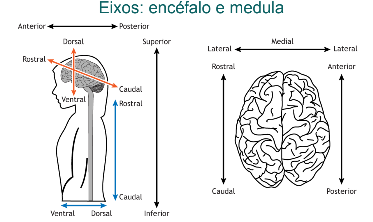
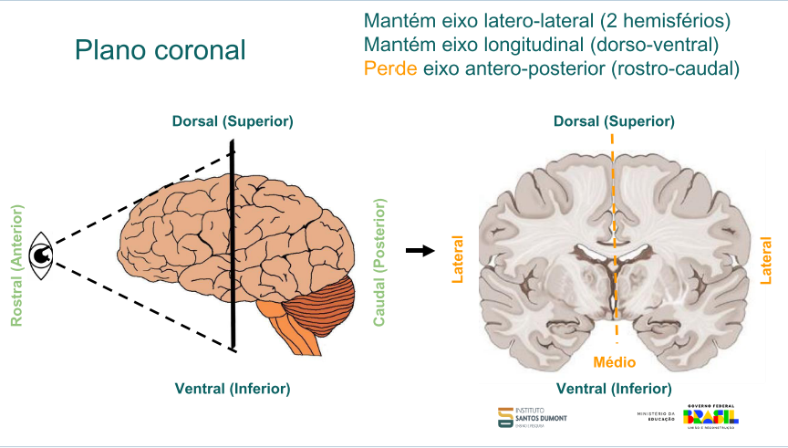
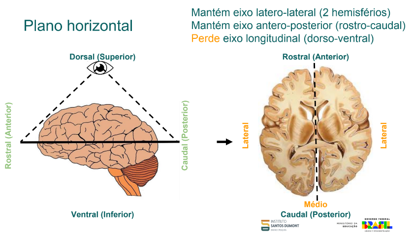
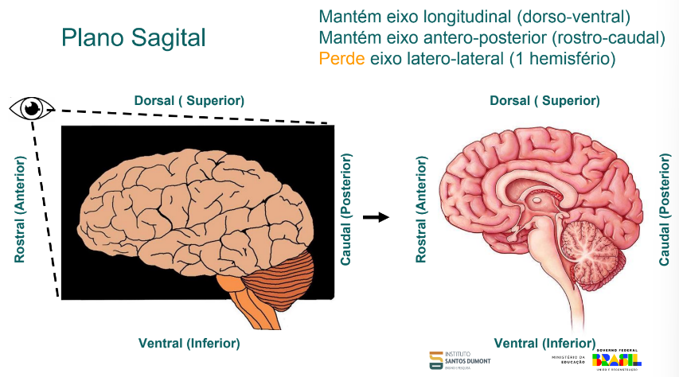
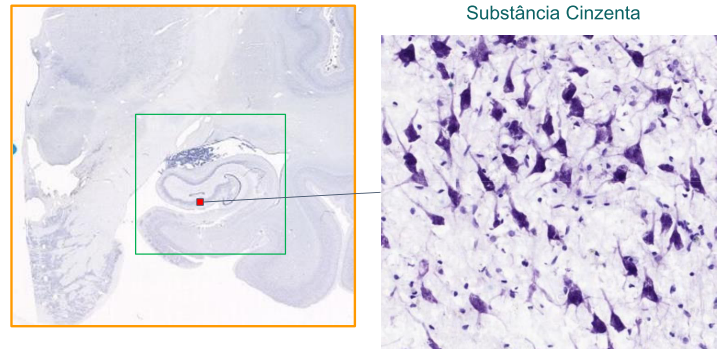
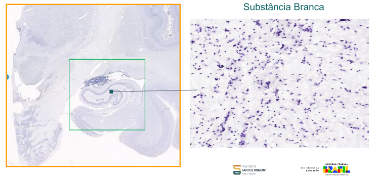
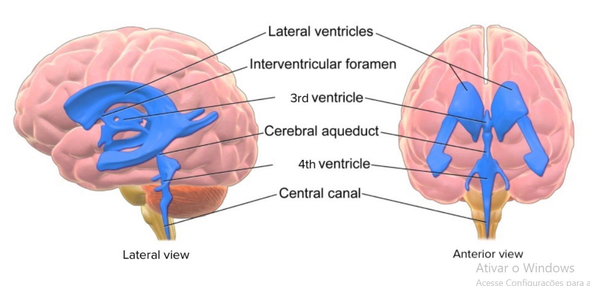
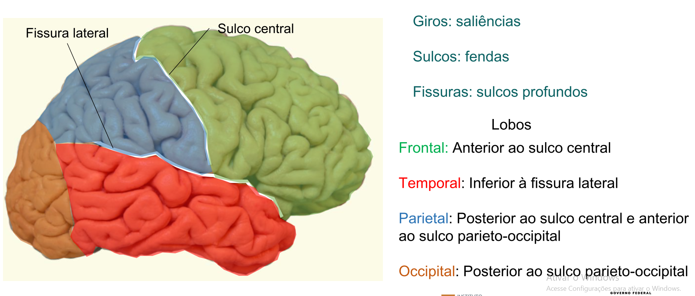
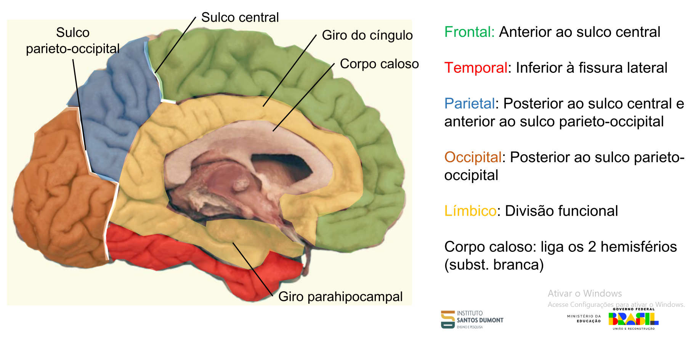

# Organização geral do sistema nervoso

1) Planos e eixos anatômicos
2) Componentes do sistema nervoso
3) Sistema nervoso central: visão geral
4) Encéfalo
   - Divisões do encéfalo
    - Telencéfalo: Córtex, hipocampo, núcleos da base e amígdala
    - Diencéfalo: Tálamo e hipotálamo
    - Tronco encefálico
    - Cerebelo

# Planos e Eixos Anatômicos

## Eixos do Corpo Humano 

- **Eixo látero-lateral**  
  - linha imaginária traçada ombro a ombro dividindo o ombro em esquerdo e direito

- **Eixo longitudinal**  
  - linha imaginária da cabeça ao pé que divide o corpo em superior (rostral) e inferior (caudal)

- **Eixo ântero-posterior**  
  - linha imaginária traçada das costas (posterior) ao umbigo (ventral)

---

**Eixo látero-lateral** é uma linha imaginária que é traçada ombro a ombro.  

Chama-se **médio-lateral** quando se toma como referência a linha média que é o meio da látero-lateral.

**Eixo longitudinal**, linha imaginária traçada dos pés à cabeça, onde a ponta inferior chamamos de **caudal** e a ponta superior de **rostral**.

**Eixo ântero-posterior**, linha traçada do umbigo à dorsal e divide o corpo em **ventral** e **dorsal**.

---

Quando a gente está falando dos eixos do encéfalo e da medula, a percepção muda, mas se olharmos para cima e formos definindo, fica mais fácil de saber, pois alinha com o do corpo.

As definições se mantêm **rostral**, **caudal**, **ventral** e **dorsal**, mas agora a parte do encéfalo próximo aos olhos vira o **rostral**.  
Cria-se uma linha imaginária até a nuca e a parte do encéfalo próximo à nuca denomina-se **caudal**.

A parte superior do encéfalo, próxima à ponta da cabeça, denominamos **dorsal** e traçamos uma linha imaginária até o queixo, onde a parte próxima ao queixo chamamos de **ventral**.

## Resumo — Direções Anatômicas

### No resto do corpo (ex: Medula):

- **Dorsal** = Posterior (*"Costas"*)
- **Ventral** = Anterior (*"Umbigo"*)
- **Rostral** = Superior (*"Cabeça"*)
- **Caudal** = Inferior (*"Pés"*)

### No encéfalo:

- **Dorsal** = Superior (*"Topo do crânio"*)
- **Ventral** = Inferior (*"Pescoço"*)
- **Rostral** = Anterior (*"Olhos"*)
- **Caudal** = Posterior (*"Nuca"*)

  
<strong>Resumo visual</strong>

  

---
# Planos e Eixos Anatômicos (Planos)

Quando falamos de plano, usamos os **eixos como referencial**, mas **muda a perspectiva**.  
Existem **3 planos principais**: o **plano sagital**, o **horizontal** (também chamado de **transversal**) e o **frontal** (também chamado de **coronal**).

---

## Plano Sagital

O plano sagital está relacionado ao **eixo látero-lateral**.  
Ele é uma **linha que atravessa o corpo pela linha média**, dividindo o lado esquerdo do lado direito.  
A palavra "sagital" vem do latim *sagitta*, que significa **flecha**.  
Esse nome é usado porque é como se uma flecha atravessasse o corpo pela frente e saísse pelas costas.

---

## Plano Horizontal ou Transversal

O plano horizontal (ou transversal) é o que **corta o corpo horizontalmente**, seguindo a direção do **eixo longitudinal**.  
Ou seja, ele **divide o corpo em duas partes**: uma parte **superior (rostral)** e uma parte **inferior (caudal)**, assim como o eixo longitudinal faz.

---

## Plano Coronal ou Frontal

O plano coronal (ou frontal) **corta o corpo pela linha imaginária do eixo ântero-posterior**,  
dividindo o corpo em **duas partes**: a **parte da frente (ventral)** e a **parte de trás (dorsal)**.  
O nome "coronal" vem de *corona*, que significa **coroa**, pois esse plano passa pela cabeça como se fosse uma coroa.

---
## Cortes no Encéfalo e Percepção dos Eixos

Quando fazemos cortes no encéfalo para visualizar regiões internas, dependendo do plano utilizado, perdemos a percepção de certo eixo anatômico.

---

### 🔹 Corte no Plano Coronal

Quando fazemos cortes no encéfalo para visualizar regiões, dependendo do plano que cortamos, por exemplo, se cortamos no plano coronal perdemos a percepção do eixo ântero-posterior e nao conseguimos dividir em rostral e caudal:

- **Mantém** o eixo **látero-lateral** (2 hemisférios)
- **Mantém** o eixo **longitudinal** (dorso-ventral)
- **Perde** o eixo **ântero-posterior** (rostro-caudal)

  
<strong>Visualizar images/imagem — Corte Coronal</strong>

  

---

### 🔹 Corte no Plano Horizontal

Já quando cortamos no plano horizontal, a percepção muda.  
Também perdemos o plano que está sendo cortado, ou seja, **perdemos a percepção do eixo longitudinal** e não conseguimos definir **dorso e ventral**, pois perdemos a referência vertical.

- **Mantém** o eixo **látero-lateral** (2 hemisférios)
- **Mantém** o eixo **ântero-posterior** (rostro-caudal)
- **Perde** o eixo **longitudinal** (dorso-ventral)

  
<strong>Visualizar images/imagem — Corte Horizontal</strong>

  

---

### 🔹 Corte no Plano Sagital

Quando fazemos o corte no plano sagital, perdemos a percepção do eixo látero-lateral e mantemos os outros dois:

- **Mantém** o eixo **ântero-posterior** (rostro-caudal)
- **Mantém** o eixo **longitudinal** (dorso-ventral)
- **Perde** o eixo **látero-lateral**

  
<strong>Visualizar images/imagem — Corte Sagital</strong>

  

## Componentes do Sistema Nervoso

O **sistema nervoso** está dividido em duas partes: **central** e **periférico**.

### 🔎 Visão Geral

- **Núcleos**: agrupamentos de corpos celulares no **SNC**  
- **Gânglios**: agrupamentos de corpos celulares no **SNP**  
- **Tratos**: conjuntos de axônios no **SNC**  
- **Nervos**: conjuntos de axônios no **SNP**

---

### 🔹 Sistema Nervoso Central (SNC)

No sistema nervoso central encontramos o **encéfalo** e a **medula espinhal**.  
O SNC é a parte responsável pela **recepção e interpretação dos estímulos**, sendo onde ocorre o **processamento das informações** do corpo.

Os principais constituintes do SNC são:
- **Encéfalo** (protegido pela caixa craniana)
- **Medula espinhal** (protegida pela coluna vertebral)

Ambos estão envolvidos por três membranas chamadas de **meninges**, que protegem essas estruturas. As meninges são:
- **Dura-máter** (a mais externa e resistente)
- **Aracnoide** (intermediária, com aspecto semelhante a uma teia)
- **Pia-máter** (a mais interna, que envolve diretamente o tecido nervoso)

Dentro do SNC, encontramos dois tipos principais de substância:
- **Substância branca**: formada pelos **axônios** dos neurônios, responsáveis por transmitir os impulsos nervosos.
- **Substância cinzenta**: onde estão os **corpos celulares** dos neurônios, local principal de processamento das informações.

---

### 🔹 Sistema Nervoso Periférico (SNP)

O SNP é responsável por **transmitir informações dos órgãos sensoriais para o SNC** e, após o processamento, **levar respostas do SNC aos músculos, glândulas e células endócrinas**.

- Os **neurônios aferentes** levam os estímulos **para** o SNC.
- Os **neurônios eferentes** conduzem as respostas **do** SNC até as estruturas-alvo.

O SNP é formado por:
- **Nervos**: feixes de fibras nervosas que transmitem os impulsos.
- **Gânglios**: aglomerados de corpos celulares de neurônios localizados fora do SNC.
- **Terminações nervosas**: estruturas especializadas na recepção de estímulos.

---

### 🔸 Subdivisões do SNP

#### 🔹 Sistema Nervoso Somático

- Controla **movimentos voluntários** (ex: movimentar um braço).
- Responsável por **respostas conscientes** e pela comunicação entre o SNC e os músculos esqueléticos.

> 📌 *O termo "somático" vem de "soma", que significa corpo.*

---

#### 🔹 Sistema Nervoso Autônomo

- Atua sobre funções **involuntárias** como **batimentos cardíacos**, **respiração**, **digestão** e **atividade hormonal**.
- Divide-se em três partes:

1. **Simpático**  
   - Acelera o funcionamento de alguns órgãos.  
   - Atua em situações de **estresse** ou emergência ("luta ou fuga").  
   - Exemplo: aceleração dos batimentos cardíacos.

2. **Parassimpático**  
   - Atua em momentos de **relaxamento** e recuperação.  
   - Exemplo: desaceleração dos batimentos após um susto.  
   - Tem **ação oposta** ao simpático (funções antagonistas).

3. **Entérico**  
   - Controla diretamente o **sistema digestivo**.  
   - Apesar de ser parte do sistema autônomo, tem relativa **autonomia funcional**.  
   - É conhecido como o “**segundo cérebro**” do corpo por conter milhões de neurônios ligados à digestão.

> 📌 *"Autônomo" significa que funciona por conta própria, sem controle consciente.*

## 🧩 Núcleos, Gânglios, Tratos e Nervos — O que são?

Esses quatro termos são usados pra descrever **agrupamentos de neurônios ou axônios** no sistema nervoso.  
A diferença entre eles depende de **onde estão localizados** e **o que estão fazendo**.

---

### 🔹 Núcleos (no SNC)

São **conjuntos de corpos celulares de neurônios** localizados dentro do **Sistema Nervoso Central** (encéfalo e medula).

Esses neurônios estão reunidos para **realizar funções específicas**, como controle motor, regulação da respiração, entre outros.

> 📌 Pense neles como “**centros de comando**” dentro do cérebro ou da medula.

---

### 🔹 Gânglios (no SNP)

São **agrupamentos de corpos celulares** localizados **fora do SNC**, ou seja, no **Sistema Nervoso Periférico**.

Participam da **transmissão de informações sensoriais ou motoras**.

> 📌 É como se fossem “**postos de retransmissão**” ao longo do caminho entre o corpo e o cérebro.

---

### 🔹 Tratos (no SNC)

São **feixes de axônios** (prolongamentos dos neurônios) que correm juntos dentro do **SNC**.

Conectam diferentes partes do encéfalo e da medula espinhal, levando e trazendo informações.

> 📌 Pensa nos tratos como "**cabos de dados internos**" do cérebro.

---

### 🔹 Nervos (no SNP)

São **feixes de axônios** localizados **fora do SNC**, no **Sistema Nervoso Periférico**.

Conectam o cérebro e a medula espinhal aos **órgãos, músculos e pele**.

> 📌 Os nervos funcionam como “**fios elétricos**” que levam ordens e trazem informações do corpo pro cérebro.

---

> ⚠️ **Importante:** Às vezes se pensa que os **neurônios estão apenas no cérebro**, mas isso **não é verdade**.  
> Os **neurônios também estão presentes na medula espinhal** (dentro do SNC), nos **gânglios do SNP** e até no **sistema entérico** (que controla o intestino).  
> O que acontece é que **os tratos e nervos** são formados apenas pelos **axônios** dos neurônios, e **não contêm corpos celulares**.

---

### 🧠 Fora do cérebro e medula (SNP):

- Os **corpos celulares** ficam nos **gânglios** (como os gânglios sensitivos da raiz dorsal ou os gânglios autonômicos).  
- Os **axônios** se organizam em **nervos** (como o **nervo vago**, **nervo ciático**, etc).

> ✅ **Conclusão**: Esses neurônios fora do SNC **são neurônios completos**, com corpo celular e axônios — **não são só prolongamentos**!

---

### 🎯 Resumindo:

| Local               | Tipo de estrutura               | Tem núcleo? | É neurônio completo? |
|--------------------|----------------------------------|-------------|------------------------|
| Encéfalo / Medula  | Núcleos, substância cinzenta     | ✅ Sim      | ✅ Sim                 |
| Gânglios (SNP)     | Gânglios sensitivos/autônomos    | ✅ Sim      | ✅ Sim                 |
| Nervos (SNP)       | Axônios agrupados                | ❌ Não      | ❌ Só prolongamentos   |
| Sistema entérico   | Neurônios entéricos completos    | ✅ Sim      | ✅ Sim                 |

---

# 🧠 Meninges — As camadas protetoras do SNC

As **meninges** são **membranas protetoras** que envolvem o **encéfalo** e a **medula espinhal**, compondo um sistema de barreiras que protege, nutre e isola o Sistema Nervoso Central (SNC).

São organizadas em **três camadas**, da mais externa para a mais interna:

---

### 🔹 Dura-máter

- **Camada mais externa**, **fibrosa e espessa**, fortemente aderida ao crânio (no encéfalo) e ao canal vertebral (na medula).
- Atua como a principal **barreira mecânica** contra impactos.
- **Única das meninges com inervação sensitiva** — por isso, dores de cabeça estão relacionadas à sua estimulação.
- Forma os **seios venosos durais** no encéfalo, responsáveis pela drenagem venosa cerebral.

> 📌 Pensa nela como a “**armadura resistente**” do sistema nervoso.

---

### 🔹 Aracnoide

- **Camada intermediária**, **fina e avascular**.
- Seu nome vem do aspecto em forma de **teia de aranha**, observado ao microscópio.
- Separa-se da pia-máter pelo **espaço subaracnóideo**, onde circula o **líquido cefalorraquidiano (LCR)**.

> 💧 O **LCR** atua na **proteção, nutrição e amortecimento** do encéfalo e da medula.

---

### 🔹 Pia-máter

- **Camada mais interna**, **delicada e altamente vascularizada**.
- Aderida diretamente ao tecido nervoso, acompanhando todos os sulcos e giros do encéfalo.
- Permite a **troca de substâncias entre o sangue e o SNC**.

> 📌 Funciona como uma “**pele fina e nutritiva**” do cérebro e da medula.

---

### 🧩 Espaços entre as camadas:

| Espaço                  | Localização                             | Conteúdo / Função                                   |
|-------------------------|-----------------------------------------|-----------------------------------------------------|
| **Epidural**            | Entre o osso (crânio/coluna) e a dura-máter | Contém gordura e vasos; importante na anestesia.   |
| **Subdural**            | Entre a dura-máter e a aracnoide        | Espaço virtual; pode se acumular sangue (hematoma). |
| **Subaracnóideo**       | Entre a aracnoide e a pia-máter         | **Contém o LCR**, maior volume do líquido aqui.     |

---

### 📌 Resumo final:

| Camada       | Posição       | Vascularização | Inervação | Função principal                      |
|--------------|----------------|----------------|-----------|----------------------------------------|
| Dura-máter   | Externa        | ❌             | ✅        | Proteção mecânica, drenagem venosa     |
| Aracnoide    | Intermediária  | ❌             | ❌        | Circulação do LCR                      |
| Pia-máter    | Interna        | ✅             | ❌        | Nutrição e troca com o tecido nervoso  |
---

# 🧠 Métodos de Aquisição do Sinal Neural

A atividade elétrica do cérebro pode ser registrada por diferentes métodos, que variam em **nível de invasividade**, **resolução espacial** e **local de colocação** dos eletrodos.

---

### 📍 EEG (Eletroencefalografia)
- **Local:** Sobre o couro cabeludo, **acima do crânio**
- **Invasivo?** ❌ Não
- **Vantagens:** Seguro, barato, amplamente utilizado
- **Desvantagens:** Baixa resolução espacial (o crânio atenua o sinal)
- **Usos comuns:** Monitoramento de ondas cerebrais, epilepsia, distúrbios do sono, BCI não invasiva

> 🧠 Pega a atividade elétrica geral do cérebro sem precisar de cirurgia

---

### 📍 ECoG Epidural
- **Local:** **Entre o crânio e a dura-máter**
- **Invasivo?** ⚠️ Pouco invasivo (cirurgia leve)
- **Vantagens:** Melhor sinal que EEG
- **Desvantagens:** Ainda sofre atenuação pela dura-máter

---

### 📍 ECoG Subdural
- **Local:** **Entre a dura-máter e a aracnóide**, sobre o córtex cerebral
- **Invasivo?** ✅ Sim
- **Vantagens:** Alta resolução espacial, ótimo sinal
- **Desvantagens:** Procedimento cirúrgico, maior risco
- **Usos comuns:** Mapeamento cirúrgico de epilepsia, BCI invasiva

> 📌 Os eletrodos ficam em contato direto com o córtex

---

### 📍 Microeletrodos intracorticais
- **Local:** Inseridos **dentro do tecido cerebral**, abaixo da pia-máter
- **Invasivo?** 🔴 Altamente invasivo
- **Vantagens:** Altíssima resolução (nível de neurônio individual)
- **Desvantagens:** Riscos cirúrgicos, inflamação, possível dano ao tecido
- **Usos comuns:** Pesquisa avançada, neuropróteses, BCI de alta precisão

---

### 🎯 Tabela Resumo

| Método             | Localização                          | Invasivo?        | Resolução   |
|-------------------|--------------------------------------|------------------|-------------|
| EEG               | Acima do crânio                      | ❌ Não            | Baixa       |
| ECoG Epidural     | Entre crânio e dura-máter            | ⚠️ Moderada       | Média       |
| ECoG Subdural     | Entre dura-máter e aracnoide         | ✅ Sim            | Alta        |
| Microeletrodos    | Dentro do cérebro (abaixo da pia)    | 🔴 Muito invasivo | Altíssima   |
---

# 🧠 Substância Branca e Substância Cinzenta

O tecido do Sistema Nervoso Central (SNC) se divide em **substância cinzenta** e **substância branca**, com funções e composições diferentes.

---

## 🌑 Substância Cinzenta

- ✅ **Contém corpos celulares neuronais**
- ✅ **Contém corpos celulares gliais**
- ⚡ Área de **processamento de informações** e **sinapses**
- 🧠 Presente no **córtex cerebral** (camada externa do cérebro) e em **núcleos profundos**
- 🌀 Na medula espinhal, forma o clássico formato de **"H" central**

---

## ⚪ Substância Branca

- ❌ **Não possui corpos celulares neuronais**
- ✅ **Contém axônios mielinizados** dos neurônios
- ✅ **Contém corpos celulares das células gliais**
- 🚀 Responsável por **transmitir sinais elétricos** entre regiões do SNC
- 🔁 Atua como “cabos de comunicação” entre diferentes áreas
- 🧠 No cérebro: está **mais internamente**
- 💥 Na medula espinhal: está **mais externamente**, envolvendo a cinzenta

---

## 📊 Comparativo

| Característica              | Substância Cinzenta             | Substância Branca               |
|-----------------------------|----------------------------------|----------------------------------|
| Cor                         | Cinzenta                         | Branca (pela mielina)            |
| Corpos celulares neuronais  | ✅ Sim                            | ❌ Não                            |
| Corpos celulares gliais     | ✅ Sim                            | ✅ Sim                            |
| Axônios                     | ❌ Poucos ou não mielinizados    | ✅ Mielinizados                   |
| Função                      | Processamento e sinapses         | Comunicação / Transmissão        |
| Local no cérebro            | Parte externa (córtex)           | Parte interna                    |
| Local na medula             | Parte interna (formato de H)     | Parte externa                    |

---

# 🧠 Sistema Ventricular do Encéfalo

O **sistema ventricular** é um conjunto de cavidades interconectadas localizadas no interior do cérebro, preenchidas por **líquido cefalorraquidiano (CSF)**.

Esse sistema tem um papel fundamental na **proteção, nutrição e homeostase** do sistema nervoso central.

---

## 🔹 Componentes do Sistema Ventricular:

- **Ventrículos Laterais (LV)**  
  São dois (esquerdo e direito), localizados em cada hemisfério cerebral. São os maiores ventrículos.

- **Terceiro Ventrículo (3V)**  
  Localizado na linha média, entre os dois tálamos.

- **Quarto Ventrículo (4V)**  
  Fica entre o tronco encefálico (posteriormente à ponte e à medula oblonga) e o cerebelo.

---

## 🔄 Conexões Entre os Ventrículos:

- **Forâmen Interventricular (de Monro):**  
  Conecta os **ventrículos laterais ao terceiro ventrículo**.

- **Aqueduto Cerebral (de Sylvius):**  
  Conecta o **terceiro ventrículo ao quarto ventrículo**.

---

## 💧 Função Principal:

- **Produção e circulação do líquido cefalorraquidiano (CSF)**, realizada principalmente pelo **plexo coróide**, uma estrutura vascular presente dentro dos ventrículos.

---

## ✅ O CSF tem funções importantes:

- 🛡️ **Proteção mecânica** do encéfalo e da medula espinhal (como um amortecedor)
- 🍽️ **Transporte de nutrientes e remoção de resíduos**
- ⚖️ **Regulação da pressão intracraniana**

---

## ⚠️ Hidrocefalia

A **hidrocefalia** é o **acúmulo anormal de líquido cefalorraquidiano (CSF)** nos ventrículos cerebrais, causando sua **dilatação** e **aumento da pressão intracraniana**.

### 🔹 Causas:
- Obstrução do fluxo do CSF  
- Dificuldade na absorção  
- Produção excessiva (raro)

### 🔹 Sintomas:
- Dor de cabeça, náuseas, visão turva  
- Aumento do crânio em bebês

---

---

# 🧠 Córtex Cerebral — Anatomia Geral

O **córtex cerebral** é a camada mais externa do cérebro, responsável por funções como percepção, linguagem, coordenação motora e tomada de decisões.

---

## 🔹 Estruturas Principais

- **Giros**: Saliências (dobras) da superfície do cérebro  
- **Sulcos**: Fendas mais superficiais entre os giros  
- **Fissuras**: Sulcos profundos

---

## 🔹 Sulcos e Fissuras Importantes

- **Sulco Central (Rolândico)**: Separa os lobos frontal e parietal  
- **Fissura Lateral (de Sylvius)**: Separa o lobo temporal dos lobos frontal e parietal  
- **Sulco Parieto-Occipital**: Separa os lobos parietal e occipital (na face medial)

---

## 🧭 Lobos Cerebrais — Localização e Função

### 🔸 Vista Lateral
- **Frontal**:  
  Função: Controle motor voluntário, tomada de decisões, raciocínio, linguagem e personalidade  
  Localização: Anterior ao sulco central

- **Parietal**:  
  Função: Processamento de informações sensoriais (tátil, dor, temperatura, pressão) e percepção espacial  
  Localização: Posterior ao sulco central e anterior ao sulco parieto-occipital

- **Temporal**:  
  Função: Processamento auditivo, linguagem e memória  
  Localização: Inferior à fissura lateral

- **Occipital**:  
  Função: Processamento da visão  
  Localização: Posterior ao sulco parieto-occipital

## Vista Lateral

### 🔸 Vista Medial
- **Frontal**: (mesmas funções da vista lateral)  
- **Occipital**: (mesmas funções da vista lateral)

- **Lobo Límbico** *(divisão funcional)*:  
  Função: Emoções, comportamento, motivação e memória  
  Inclui: **Giro parahipocampal**, **hipocampo**, **amígdala**

- **Corpo Caloso**:  
  Função: Comunicação entre os dois hemisférios cerebrais  
  Tipo: Estrutura de substância branca

---

## Vista Medial 

## 🧩 A Ínsula (ou Lobo da Ínsula)

- A **ínsula** está localizada profundamente dentro da fissura lateral, coberta pelos lobos frontal, parietal e temporal.  
- **Funções**:  
  - Percepção visceral (sensações internas)  
  - Emoções  
  - Consciência corporal  
  - Envolvimento com o gosto e percepção da dor

---

