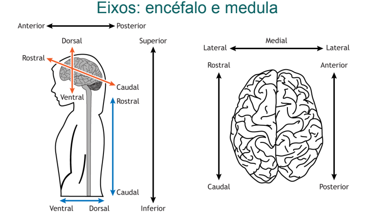
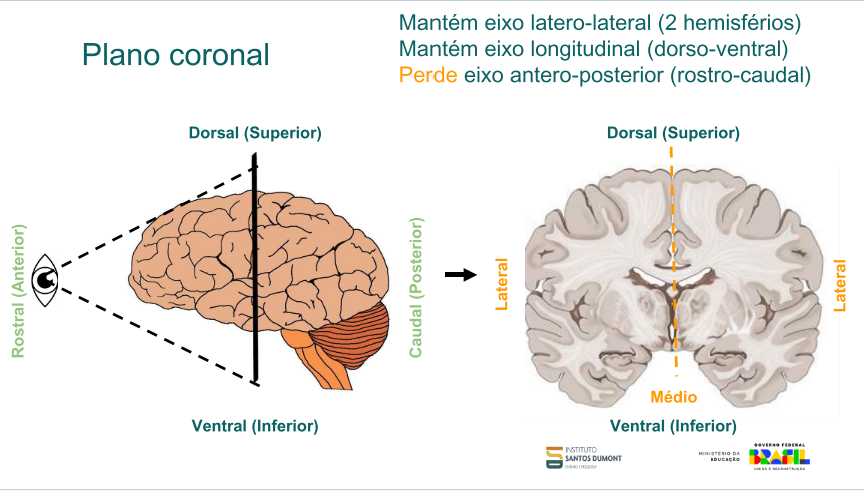
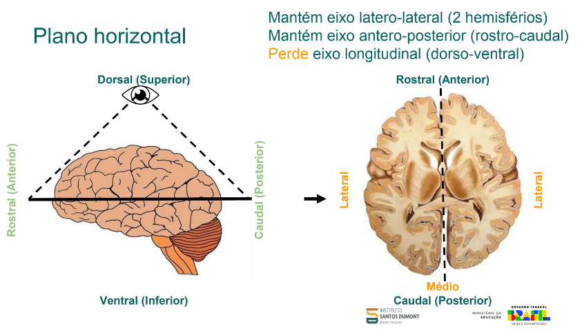
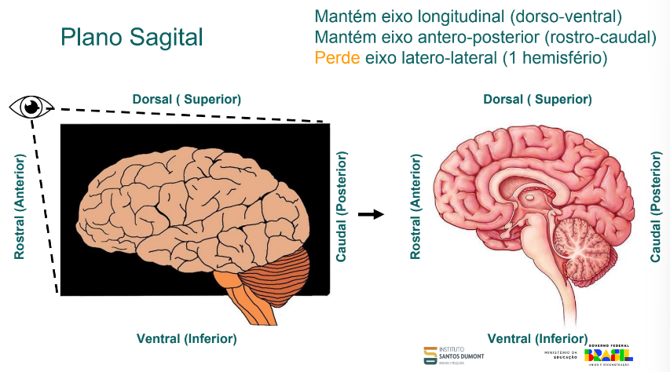
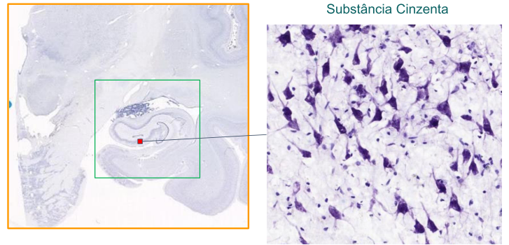
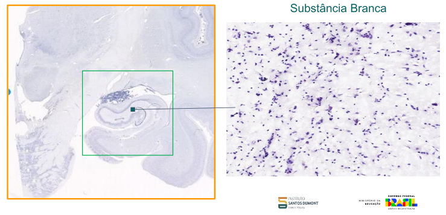
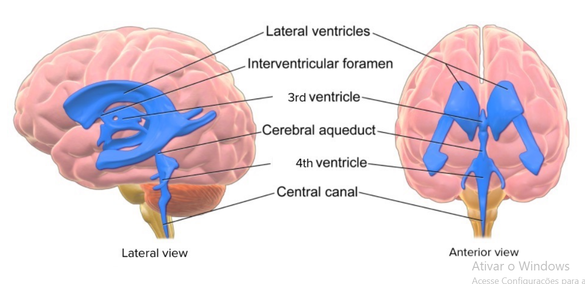
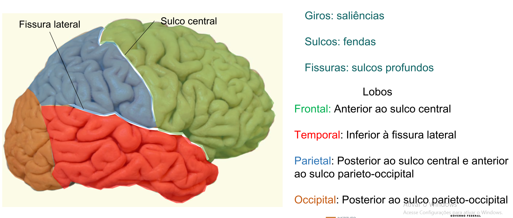
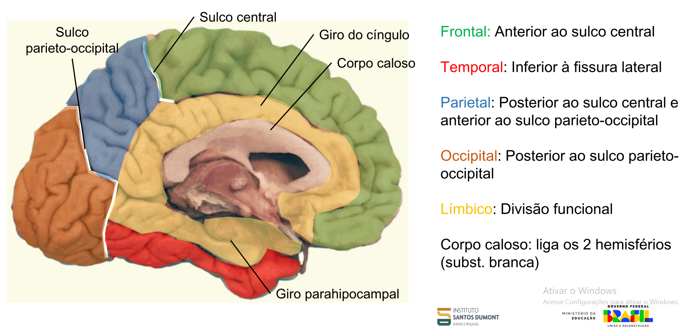

# Organização geral do sistema nervoso

1) Planos e eixos anatômicos
2) Componentes do sistema nervoso
3) Sistema nervoso central: visão geral
4) Encéfalo
   - Divisões do encéfalo
    - Telencéfalo: Córtex, hipocampo, núcleos da base e amígdala
    - Diencéfalo: Tálamo e hipotálamo
    - Tronco encefálico
    - Cerebelo

# Planos e Eixos Anatômicos

## Eixos do Corpo Humano 

- **Eixo látero-lateral**  
  - linha imaginária traçada ombro a ombro dividindo o ombro em esquerdo e direito

- **Eixo longitudinal**  
  - linha imaginária da cabeça ao pé que divide o corpo em superior (rostral) e inferior (caudal)

- **Eixo ântero-posterior**  
  - linha imaginária traçada das costas (posterior) ao umbigo (ventral)

---

**Eixo látero-lateral** é uma linha imaginária que é traçada ombro a ombro.  

Chama-se **médio-lateral** quando se toma como referência a linha média que é o meio da látero-lateral.

**Eixo longitudinal**, linha imaginária traçada dos pés à cabeça, onde a ponta inferior chamamos de **caudal** e a ponta superior de **rostral**.

**Eixo ântero-posterior**, linha traçada do umbigo à dorsal e divide o corpo em **ventral** e **dorsal**.

---

Quando a gente está falando dos eixos do encéfalo e da medula, a percepção muda, mas se olharmos para cima e formos definindo, fica mais fácil de saber, pois alinha com o do corpo.

As definições se mantêm **rostral**, **caudal**, **ventral** e **dorsal**, mas agora a parte do encéfalo próximo aos olhos vira o **rostral**.  
Cria-se uma linha imaginária até a nuca e a parte do encéfalo próximo à nuca denomina-se **caudal**.

A parte superior do encéfalo, próxima à ponta da cabeça, denominamos **dorsal** e traçamos uma linha imaginária até o queixo, onde a parte próxima ao queixo chamamos de **ventral**.

## Resumo — Direções Anatômicas

### No resto do corpo (ex: Medula):

- **Dorsal** = Posterior (*"Costas"*)
- **Ventral** = Anterior (*"Umbigo"*)
- **Rostral** = Superior (*"Cabeça"*)
- **Caudal** = Inferior (*"Pés"*)


### No encéfalo:

- **Dorsal** = Superior (*"Topo do crânio"*)
- **Ventral** = Inferior (*"Pescoço"*)
- **Rostral** = Anterior (*"Olhos"*)
- **Caudal** = Posterior (*"Nuca"*)


<details>
  <summary><strong>Resumo visual</strong></summary>

  

</details>

---
# Planos e Eixos Anatômicos (Planos)

Quando falamos de plano, usamos os **eixos como referencial**, mas **muda a perspectiva**.  
Existem **3 planos principais**: o **plano sagital**, o **horizontal** (também chamado de **transversal**) e o **frontal** (também chamado de **coronal**).

---

## Plano Sagital

O plano sagital está relacionado ao **eixo látero-lateral**.  
Ele é uma **linha que atravessa o corpo pela linha média**, dividindo o lado esquerdo do lado direito.  
A palavra "sagital" vem do latim *sagitta*, que significa **flecha**.  
Esse nome é usado porque é como se uma flecha atravessasse o corpo pela frente e saísse pelas costas.

---

## Plano Horizontal ou Transversal

O plano horizontal (ou transversal) é o que **corta o corpo horizontalmente**, seguindo a direção do **eixo longitudinal**.  
Ou seja, ele **divide o corpo em duas partes**: uma parte **superior (rostral)** e uma parte **inferior (caudal)**, assim como o eixo longitudinal faz.

---

## Plano Coronal ou Frontal

O plano coronal (ou frontal) **corta o corpo pela linha imaginária do eixo ântero-posterior**,  
dividindo o corpo em **duas partes**: a **parte da frente (ventral)** e a **parte de trás (dorsal)**.  
O nome "coronal" vem de *corona*, que significa **coroa**, pois esse plano passa pela cabeça como se fosse uma coroa.

---
## Cortes no Encéfalo e Percepção dos Eixos

Quando fazemos cortes no encéfalo para visualizar regiões internas, dependendo do plano utilizado, perdemos a percepção de certo eixo anatômico.

---

### 🔹 Corte no Plano Coronal

Quando fazemos cortes no encéfalo para visualizar regiões, dependendo do plano que cortamos, por exemplo, se cortamos no plano coronal perdemos a percepção do eixo ântero-posterior e nao conseguimos dividir em rostral e caudal:

- **Mantém** o eixo **látero-lateral** (2 hemisférios)
- **Mantém** o eixo **longitudinal** (dorso-ventral)
- **Perde** o eixo **ântero-posterior** (rostro-caudal)

<details>
  <summary><strong>Visualizar images/imagem — Corte Coronal</strong></summary>

  

</details>

---

### 🔹 Corte no Plano Horizontal

Já quando cortamos no plano horizontal, a percepção muda.  
Também perdemos o plano que está sendo cortado, ou seja, **perdemos a percepção do eixo longitudinal** e não conseguimos definir **dorso e ventral**, pois perdemos a referência vertical.

- **Mantém** o eixo **látero-lateral** (2 hemisférios)
- **Mantém** o eixo **ântero-posterior** (rostro-caudal)
- **Perde** o eixo **longitudinal** (dorso-ventral)

<details>
  <summary><strong>Visualizar images/imagem — Corte Horizontal</strong></summary>

  

</details>

---

### 🔹 Corte no Plano Sagital

Quando fazemos o corte no plano sagital, perdemos a percepção do eixo látero-lateral e mantemos os outros dois:

- **Mantém** o eixo **ântero-posterior** (rostro-caudal)
- **Mantém** o eixo **longitudinal** (dorso-ventral)
- **Perde** o eixo **látero-lateral**

<details>
  <summary><strong>Visualizar images/imagem — Corte Sagital</strong></summary>

  

</details>


## Componentes do Sistema Nervoso

O **sistema nervoso** está dividido em duas partes: **central** e **periférico**.

### 🔎 Visão Geral

- **Núcleos**: agrupamentos de corpos celulares no **SNC**  
- **Gânglios**: agrupamentos de corpos celulares no **SNP**  
- **Tratos**: conjuntos de axônios no **SNC**  
- **Nervos**: conjuntos de axônios no **SNP**

---

### 🔹 Sistema Nervoso Central (SNC)

No sistema nervoso central encontramos o **encéfalo** e a **medula espinhal**.  
O SNC é a parte responsável pela **recepção e interpretação dos estímulos**, sendo onde ocorre o **processamento das informações** do corpo.

Os principais constituintes do SNC são:
- **Encéfalo** (protegido pela caixa craniana)
- **Medula espinhal** (protegida pela coluna vertebral)

Ambos estão envolvidos por três membranas chamadas de **meninges**, que protegem essas estruturas. As meninges são:
- **Dura-máter** (a mais externa e resistente)
- **Aracnoide** (intermediária, com aspecto semelhante a uma teia)
- **Pia-máter** (a mais interna, que envolve diretamente o tecido nervoso)

Dentro do SNC, encontramos dois tipos principais de substância:
- **Substância branca**: formada pelos **axônios** dos neurônios, responsáveis por transmitir os impulsos nervosos.
- **Substância cinzenta**: onde estão os **corpos celulares** dos neurônios, local principal de processamento das informações.

---

### 🔹 Sistema Nervoso Periférico (SNP)

O SNP é responsável por **transmitir informações dos órgãos sensoriais para o SNC** e, após o processamento, **levar respostas do SNC aos músculos, glândulas e células endócrinas**.

- Os **neurônios aferentes** levam os estímulos **para** o SNC.
- Os **neurônios eferentes** conduzem as respostas **do** SNC até as estruturas-alvo.

O SNP é formado por:
- **Nervos**: feixes de fibras nervosas que transmitem os impulsos.
- **Gânglios**: aglomerados de corpos celulares de neurônios localizados fora do SNC.
- **Terminações nervosas**: estruturas especializadas na recepção de estímulos.

---

### 🔸 Subdivisões do SNP

#### 🔹 Sistema Nervoso Somático

- Controla **movimentos voluntários** (ex: movimentar um braço).
- Responsável por **respostas conscientes** e pela comunicação entre o SNC e os músculos esqueléticos.

> 📌 *O termo "somático" vem de "soma", que significa corpo.*

---

#### 🔹 Sistema Nervoso Autônomo

- Atua sobre funções **involuntárias** como **batimentos cardíacos**, **respiração**, **digestão** e **atividade hormonal**.
- Divide-se em três partes:

1. **Simpático**  
   - Acelera o funcionamento de alguns órgãos.  
   - Atua em situações de **estresse** ou emergência ("luta ou fuga").  
   - Exemplo: aceleração dos batimentos cardíacos.

2. **Parassimpático**  
   - Atua em momentos de **relaxamento** e recuperação.  
   - Exemplo: desaceleração dos batimentos após um susto.  
   - Tem **ação oposta** ao simpático (funções antagonistas).

3. **Entérico**  
   - Controla diretamente o **sistema digestivo**.  
   - Apesar de ser parte do sistema autônomo, tem relativa **autonomia funcional**.  
   - É conhecido como o “**segundo cérebro**” do corpo por conter milhões de neurônios ligados à digestão.

> 📌 *"Autônomo" significa que funciona por conta própria, sem controle consciente.*


## 🧩 Núcleos, Gânglios, Tratos e Nervos — O que são?

Esses quatro termos são usados pra descrever **agrupamentos de neurônios ou axônios** no sistema nervoso.  
A diferença entre eles depende de **onde estão localizados** e **o que estão fazendo**.

---

### 🔹 Núcleos (no SNC)

São **conjuntos de corpos celulares de neurônios** localizados dentro do **Sistema Nervoso Central** (encéfalo e medula).

Esses neurônios estão reunidos para **realizar funções específicas**, como controle motor, regulação da respiração, entre outros.

> 📌 Pense neles como “**centros de comando**” dentro do cérebro ou da medula.

---

### 🔹 Gânglios (no SNP)

São **agrupamentos de corpos celulares** localizados **fora do SNC**, ou seja, no **Sistema Nervoso Periférico**.

Participam da **transmissão de informações sensoriais ou motoras**.

> 📌 É como se fossem “**postos de retransmissão**” ao longo do caminho entre o corpo e o cérebro.

---

### 🔹 Tratos (no SNC)

São **feixes de axônios** (prolongamentos dos neurônios) que correm juntos dentro do **SNC**.

Conectam diferentes partes do encéfalo e da medula espinhal, levando e trazendo informações.

> 📌 Pensa nos tratos como "**cabos de dados internos**" do cérebro.

---

### 🔹 Nervos (no SNP)

São **feixes de axônios** localizados **fora do SNC**, no **Sistema Nervoso Periférico**.

Conectam o cérebro e a medula espinhal aos **órgãos, músculos e pele**.

> 📌 Os nervos funcionam como “**fios elétricos**” que levam ordens e trazem informações do corpo pro cérebro.

---

> ⚠️ **Importante:** Às vezes se pensa que os **neurônios estão apenas no cérebro**, mas isso **não é verdade**.  
> Os **neurônios também estão presentes na medula espinhal** (dentro do SNC), nos **gânglios do SNP** e até no **sistema entérico** (que controla o intestino).  
> O que acontece é que **os tratos e nervos** são formados apenas pelos **axônios** dos neurônios, e **não contêm corpos celulares**.

---

### 🧠 Fora do cérebro e medula (SNP):

- Os **corpos celulares** ficam nos **gânglios** (como os gânglios sensitivos da raiz dorsal ou os gânglios autonômicos).  
- Os **axônios** se organizam em **nervos** (como o **nervo vago**, **nervo ciático**, etc).

> ✅ **Conclusão**: Esses neurônios fora do SNC **são neurônios completos**, com corpo celular e axônios — **não são só prolongamentos**!

---

### 🎯 Resumindo:

| Local               | Tipo de estrutura               | Tem núcleo? | É neurônio completo? |
|--------------------|----------------------------------|-------------|------------------------|
| Encéfalo / Medula  | Núcleos, substância cinzenta     | ✅ Sim      | ✅ Sim                 |
| Gânglios (SNP)     | Gânglios sensitivos/autônomos    | ✅ Sim      | ✅ Sim                 |
| Nervos (SNP)       | Axônios agrupados                | ❌ Não      | ❌ Só prolongamentos   |
| Sistema entérico   | Neurônios entéricos completos    | ✅ Sim      | ✅ Sim                 |

---

# 🧠 Meninges — As camadas protetoras do SNC

As **meninges** são **membranas protetoras** que envolvem o **encéfalo** e a **medula espinhal**, compondo um sistema de barreiras que protege, nutre e isola o Sistema Nervoso Central (SNC).

São organizadas em **três camadas**, da mais externa para a mais interna:

---

### 🔹 Dura-máter

- **Camada mais externa**, **fibrosa e espessa**, fortemente aderida ao crânio (no encéfalo) e ao canal vertebral (na medula).
- Atua como a principal **barreira mecânica** contra impactos.
- **Única das meninges com inervação sensitiva** — por isso, dores de cabeça estão relacionadas à sua estimulação.
- Forma os **seios venosos durais** no encéfalo, responsáveis pela drenagem venosa cerebral.

> 📌 Pensa nela como a “**armadura resistente**” do sistema nervoso.

---

### 🔹 Aracnoide

- **Camada intermediária**, **fina e avascular**.
- Seu nome vem do aspecto em forma de **teia de aranha**, observado ao microscópio.
- Separa-se da pia-máter pelo **espaço subaracnóideo**, onde circula o **líquido cefalorraquidiano (LCR)**.

> 💧 O **LCR** atua na **proteção, nutrição e amortecimento** do encéfalo e da medula.

---

### 🔹 Pia-máter

- **Camada mais interna**, **delicada e altamente vascularizada**.
- Aderida diretamente ao tecido nervoso, acompanhando todos os sulcos e giros do encéfalo.
- Permite a **troca de substâncias entre o sangue e o SNC**.

> 📌 Funciona como uma “**pele fina e nutritiva**” do cérebro e da medula.

---

### 🧩 Espaços entre as camadas:

| Espaço                  | Localização                             | Conteúdo / Função                                   |
|-------------------------|-----------------------------------------|-----------------------------------------------------|
| **Epidural**            | Entre o osso (crânio/coluna) e a dura-máter | Contém gordura e vasos; importante na anestesia.   |
| **Subdural**            | Entre a dura-máter e a aracnoide        | Espaço virtual; pode se acumular sangue (hematoma). |
| **Subaracnóideo**       | Entre a aracnoide e a pia-máter         | **Contém o LCR**, maior volume do líquido aqui.     |

---

### 📌 Resumo final:

| Camada       | Posição       | Vascularização | Inervação | Função principal                      |
|--------------|----------------|----------------|-----------|----------------------------------------|
| Dura-máter   | Externa        | ❌             | ✅        | Proteção mecânica, drenagem venosa     |
| Aracnoide    | Intermediária  | ❌             | ❌        | Circulação do LCR                      |
| Pia-máter    | Interna        | ✅             | ❌        | Nutrição e troca com o tecido nervoso  |
---

# 🧠 Métodos de Aquisição do Sinal Neural

A atividade elétrica do cérebro pode ser registrada por diferentes métodos, que variam em **nível de invasividade**, **resolução espacial** e **local de colocação** dos eletrodos.

---

### 📍 EEG (Eletroencefalografia)
- **Local:** Sobre o couro cabeludo, **acima do crânio**
- **Invasivo?** ❌ Não
- **Vantagens:** Seguro, barato, amplamente utilizado
- **Desvantagens:** Baixa resolução espacial (o crânio atenua o sinal)
- **Usos comuns:** Monitoramento de ondas cerebrais, epilepsia, distúrbios do sono, BCI não invasiva

> 🧠 Pega a atividade elétrica geral do cérebro sem precisar de cirurgia

---

### 📍 ECoG Epidural
- **Local:** **Entre o crânio e a dura-máter**
- **Invasivo?** ⚠️ Pouco invasivo (cirurgia leve)
- **Vantagens:** Melhor sinal que EEG
- **Desvantagens:** Ainda sofre atenuação pela dura-máter

---

### 📍 ECoG Subdural
- **Local:** **Entre a dura-máter e a aracnóide**, sobre o córtex cerebral
- **Invasivo?** ✅ Sim
- **Vantagens:** Alta resolução espacial, ótimo sinal
- **Desvantagens:** Procedimento cirúrgico, maior risco
- **Usos comuns:** Mapeamento cirúrgico de epilepsia, BCI invasiva

> 📌 Os eletrodos ficam em contato direto com o córtex

---

### 📍 Microeletrodos intracorticais
- **Local:** Inseridos **dentro do tecido cerebral**, abaixo da pia-máter
- **Invasivo?** 🔴 Altamente invasivo
- **Vantagens:** Altíssima resolução (nível de neurônio individual)
- **Desvantagens:** Riscos cirúrgicos, inflamação, possível dano ao tecido
- **Usos comuns:** Pesquisa avançada, neuropróteses, BCI de alta precisão

---

### 🎯 Tabela Resumo

| Método             | Localização                          | Invasivo?        | Resolução   |
|-------------------|--------------------------------------|------------------|-------------|
| EEG               | Acima do crânio                      | ❌ Não            | Baixa       |
| ECoG Epidural     | Entre crânio e dura-máter            | ⚠️ Moderada       | Média       |
| ECoG Subdural     | Entre dura-máter e aracnoide         | ✅ Sim            | Alta        |
| Microeletrodos    | Dentro do cérebro (abaixo da pia)    | 🔴 Muito invasivo | Altíssima   |
---

# 🧠 Substância Branca e Substância Cinzenta

O tecido do Sistema Nervoso Central (SNC) se divide em **substância cinzenta** e **substância branca**, com funções e composições diferentes.

---

## 🌑 Substância Cinzenta

- ✅ **Contém corpos celulares neuronais**
- ✅ **Contém corpos celulares gliais**
- ⚡ Área de **processamento de informações** e **sinapses**
- 🧠 Presente no **córtex cerebral** (camada externa do cérebro) e em **núcleos profundos**
- 🌀 Na medula espinhal, forma o clássico formato de **"H" central**



---

## ⚪ Substância Branca

- ❌ **Não possui corpos celulares neuronais**
- ✅ **Contém axônios mielinizados** dos neurônios
- ✅ **Contém corpos celulares das células gliais**
- 🚀 Responsável por **transmitir sinais elétricos** entre regiões do SNC
- 🔁 Atua como “cabos de comunicação” entre diferentes áreas
- 🧠 No cérebro: está **mais internamente**
- 💥 Na medula espinhal: está **mais externamente**, envolvendo a cinzenta


---

## 📊 Comparativo

| Característica              | Substância Cinzenta             | Substância Branca               |
|-----------------------------|----------------------------------|----------------------------------|
| Cor                         | Cinzenta                         | Branca (pela mielina)            |
| Corpos celulares neuronais  | ✅ Sim                            | ❌ Não                            |
| Corpos celulares gliais     | ✅ Sim                            | ✅ Sim                            |
| Axônios                     | ❌ Poucos ou não mielinizados    | ✅ Mielinizados                   |
| Função                      | Processamento e sinapses         | Comunicação / Transmissão        |
| Local no cérebro            | Parte externa (córtex)           | Parte interna                    |
| Local na medula             | Parte interna (formato de H)     | Parte externa                    |

---

# 🧠 Sistema Ventricular do Encéfalo

O **sistema ventricular** é um conjunto de cavidades interconectadas localizadas no interior do cérebro, preenchidas por **líquido cefalorraquidiano (CSF)**.

Esse sistema tem um papel fundamental na **proteção, nutrição e homeostase** do sistema nervoso central.

---

## 🔹 Componentes do Sistema Ventricular:

- **Ventrículos Laterais (LV)**  
  São dois (esquerdo e direito), localizados em cada hemisfério cerebral. São os maiores ventrículos.

- **Terceiro Ventrículo (3V)**  
  Localizado na linha média, entre os dois tálamos.

- **Quarto Ventrículo (4V)**  
  Fica entre o tronco encefálico (posteriormente à ponte e à medula oblonga) e o cerebelo.

---

## 🔄 Conexões Entre os Ventrículos:

- **Forâmen Interventricular (de Monro):**  
  Conecta os **ventrículos laterais ao terceiro ventrículo**.

- **Aqueduto Cerebral (de Sylvius):**  
  Conecta o **terceiro ventrículo ao quarto ventrículo**.

---

## 💧 Função Principal:

- **Produção e circulação do líquido cefalorraquidiano (CSF)**, realizada principalmente pelo **plexo coróide**, uma estrutura vascular presente dentro dos ventrículos.

---

## ✅ O CSF tem funções importantes:

- 🛡️ **Proteção mecânica** do encéfalo e da medula espinhal (como um amortecedor)
- 🍽️ **Transporte de nutrientes e remoção de resíduos**
- ⚖️ **Regulação da pressão intracraniana**

---




## ⚠️ Hidrocefalia

A **hidrocefalia** é o **acúmulo anormal de líquido cefalorraquidiano (CSF)** nos ventrículos cerebrais, causando sua **dilatação** e **aumento da pressão intracraniana**.

### 🔹 Causas:
- Obstrução do fluxo do CSF  
- Dificuldade na absorção  
- Produção excessiva (raro)

### 🔹 Sintomas:
- Dor de cabeça, náuseas, visão turva  
- Aumento do crânio em bebês


---

---

# 🧠 Córtex Cerebral — Anatomia Geral

O **córtex cerebral** é a camada mais externa do cérebro, responsável por funções como percepção, linguagem, coordenação motora e tomada de decisões.

---

## 🔹 Estruturas Principais

- **Giros**: Saliências (dobras) da superfície do cérebro  
- **Sulcos**: Fendas mais superficiais entre os giros  
- **Fissuras**: Sulcos profundos

---

## 🔹 Sulcos e Fissuras Importantes

- **Sulco Central (Rolândico)**: Separa os lobos frontal e parietal  
- **Fissura Lateral (de Sylvius)**: Separa o lobo temporal dos lobos frontal e parietal  
- **Sulco Parieto-Occipital**: Separa os lobos parietal e occipital (na face medial)

---

## 🧭 Lobos Cerebrais — Localização e Função

### 🔸 Vista Lateral
- **Frontal**:  
  Função: Controle motor voluntário, tomada de decisões, raciocínio, linguagem e personalidade  
  Localização: Anterior ao sulco central

- **Parietal**:  
  Função: Processamento de informações sensoriais (tátil, dor, temperatura, pressão) e percepção espacial  
  Localização: Posterior ao sulco central e anterior ao sulco parieto-occipital

- **Temporal**:  
  Função: Processamento auditivo, linguagem e memória  
  Localização: Inferior à fissura lateral

- **Occipital**:  
  Função: Processamento da visão  
  Localização: Posterior ao sulco parieto-occipital

## Vista Lateral


### 🔸 Vista Medial
- **Frontal**: (mesmas funções da vista lateral)  
- **Occipital**: (mesmas funções da vista lateral)

- **Lobo Límbico** *(divisão funcional)*:  
  Função: Emoções, comportamento, motivação e memória  
  Inclui: **Giro parahipocampal**, **hipocampo**, **amígdala**

- **Corpo Caloso**:  
  Função: Comunicação entre os dois hemisférios cerebrais  
  Tipo: Estrutura de substância branca

---


## Vista Medial 



## 🧩 A Ínsula (ou Lobo da Ínsula)

- A **ínsula** está localizada profundamente dentro da fissura lateral, coberta pelos lobos frontal, parietal e temporal.  
- **Funções**:  
  - Percepção visceral (sensações internas)  
  - Emoções  
  - Consciência corporal  
  - Envolvimento com o gosto e percepção da dor

---


##
## Córtex cerebral: Histologia

# Histologia do Córtex Cerebral

Função: Processamento e integração de sinais

A **histologia** é o ramo da biologia que estuda os **tecidos** do corpo humano em nível **microscópico**. No caso do **córtex cerebral**, a histologia é essencial para entender como os neurônios estão organizados e como eles se conectam para permitir o processamento de informações no sistema nervoso central.

O **córtex cerebral** é a camada mais externa do cérebro e é responsável por funções complexas como percepção, pensamento, memória e controle motor. Do ponto de vista histológico, ele é composto por **substância cinzenta**, formada por corpos celulares de neurônios, dendritos, axônios não mielinizados e células da glia.

## Camadas do Córtex Cerebral

O córtex cerebral é organizado em **seis camadas distintas**, que variam em espessura e composição celular dependendo da região do córtex (como córtex sensorial, motor, etc). De fora para dentro, as camadas são:

### 1. Camada Molecular (I)
- É a **mais externa**.
- Possui poucos corpos celulares.
- Rica em fibras nervosas (axônios e dendritos) e sinapses.
- Função principal: **integração de sinais**.

### 2. Camada Granular Externa (II)
- Contém **neurônios pequenos** (granulares).
- Faz conexões com outras áreas corticais.
- Envolvida no processamento de informações recebidas.

### 3. Camada Piramidal Externa (III)
- Presença de **neurônios piramidais** de tamanho médio.
- Seus axônios se projetam para outras partes do córtex (conexões cortico-corticais).

### 4. Camada Granular Interna (IV)
- Rica em **neurônios granulares**.
- Principal área de **recebimento de informações sensoriais** do tálamo.
- Muito desenvolvida em áreas sensoriais do córtex.

### 5. Camada Piramidal Interna (V)
- Contém **neurônios piramidais grandes**, como as células de Betz.
- Seus axônios se projetam para regiões subcorticais, como o tronco encefálico e medula espinhal.
- Importante no **controle motor**.

### 6. Camada Multiforme (VI)
- É a **mais interna**.
- Contém uma variedade de tipos celulares (por isso "multiforme").
- Envia axônios principalmente para o tálamo.


## Técnicas Histológicas Utilizadas


Para estudar essas camadas e células, são utilizadas diferentes **técnicas de coloração**, que ajudam a visualizar as estruturas ao microscópio:

### Coloração de Nissl
- Marca **todos os corpos celulares** dos neurônios.
- Utiliza corantes que se ligam ao RNA dos ribossomos.
- Muito usada para identificar a **densidade e distribuição dos neurônios** em uma determinada região.

### Técnica de Golgi
- Marca **apenas alguns neurônios**, mas com **alto detalhamento**.
- Permite visualizar o **corpo celular**, **axônio** e **dendritos** do neurônio.
- Ideal para estudar a **morfologia neuronal** e suas conexões.

---

> 📌 **Resumo**:  
O estudo histológico do córtex cerebral revela uma organização em 6 camadas, cada uma com função e tipos celulares específicos. As técnicas de Nissl e Golgi são fundamentais para analisar essa estrutura e entender como o cérebro processa e integra sinais.


## Explicação Simples (como se fosse para uma criança)

Imagina que o **cérebro** é como uma **central de controle superinteligente** que ajuda a gente a pensar, lembrar, se mover e sentir as coisas.

Essa central de controle tem uma parte chamada **córtex cerebral**, que é como a "casquinha" de fora do cérebro. Por dentro dessa casquinha, existem **várias camadas**, como um **bolo de camadas**. Cada camada tem tipos diferentes de células que fazem trabalhos diferentes: umas mandam mensagens, outras recebem, outras conectam ideias... é uma equipe bem organizada!

Para os cientistas conseguirem **ver essas camadas e células**, eles usam **tintas especiais** (chamadas de colorações). Uma delas, chamada **Nissl**, pinta todas as células para vermos onde estão. Outra, chamada **Golgi**, pinta só algumas, mas mostra todos os detalhes — como se fosse uma arte do neurônio!

Então, estudar a histologia do cérebro é como olhar dentro de uma máquina incrível com uma lupa poderosa, entendendo como cada pecinha ajuda a gente a ser quem somos. 🧠✨


# Hipocampo: Estrutura e Função

O **hipocampo** é uma estrutura do cérebro localizada no **lobo temporal medial**, em ambos os hemisférios cerebrais. Seu nome vem do grego “hippos” (cavalo) + “kampos” (monstro marinho), por lembrar um cavalo-marinho na forma.

É parte integrante do **sistema límbico**, que está relacionado às emoções, à motivação, ao comportamento e à memória.

## Principais Funções do Hipocampo

### 1. Memória
- O hipocampo é essencial para a **formação de novas memórias**.
- Ele transforma memórias de curto prazo em **memórias de longo prazo** (consolidação).
- Lesões no hipocampo podem causar **amnésia anterógrada** — dificuldade de formar novas memórias.

### 2. Navegação Espacial
- O hipocampo ajuda a criar **mapas mentais** dos ambientes que exploramos.
- Nele existem os **neurônios de lugar** (place cells), que ativam em locais específicos, facilitando a **orientação espacial**.

### 3. Aprendizado
- Atua no aprendizado **associativo** e em tarefas que envolvem reconhecimento de padrões.
- Trabalha junto com outras áreas do cérebro para processar e **armazenar experiências**.

## Anatomia Básica

O hipocampo é composto por várias subestruturas, sendo as principais:

- **Subículo**
- **CA1, CA2, CA3 (Cornu Ammonis)**: regiões onde ocorrem muitas sinapses importantes.
- **Giro denteado**: importante para a formação de novas conexões neurais (neurogênese).

---

## Componentes e Circuito Clássico do Hipocampo

O hipocampo processa informações por meio de um **circuito neural bem organizado**, conhecido como **via trissináptica**. A sequência geral é:

**Giro Dentado → CA3 → CA2 → CA1 → Subículo → Fórnix**

### 🧠 1. Giro Dentado
- Porta de entrada das informações vindas do córtex entorrinal.
- Contém **neurônios granulares**.
- Envia sinais para o CA3.

### 🧠 2. CA3
- Recebe sinais do giro dentado.
- Possui **neurônios piramidais** com muitas conexões internas.
- Importante para **memória associativa**.
- Projeta para CA1 e CA2.

### 🧠 3. CA2
- Região menor, entre CA3 e CA1.
- Participa de funções sociais (como reconhecimento de rostos).
- Transmite sinais para o CA1.

### 🧠 4. CA1
- Área altamente sensível e muito estudada.
- Essencial para a **consolidação de memórias**.
- Envia informações para o subículo.

### 🧠 5. Subículo
- Ponte de saída do hipocampo.
- Envia dados para o **córtex entorrinal**, **córtex pré-frontal**, entre outros.

### 🧠 6. Fórnix
- Estrutura de fibras nervosas que leva informações do hipocampo para o restante do sistema límbico (ex: corpos mamilares, tálamo).
- Responsável por **distribuir as memórias** para outras áreas do cérebro.

#### 📈 Fluxo Resumido do Circuito
```text
Córtex entorrinal
     ↓
Giro dentado
     ↓
CA3 → CA2
     ↓
CA1
     ↓
Subículo
     ↓
Fórnix
     ↓
Outras áreas (tálamo, córtex pré-frontal etc.)
```
## Explicação Simples (como se fosse para uma criança)

Imagina que dentro do seu cérebro existe uma **caixinha mágica de lembranças**. Essa caixinha é o **hipocampo**! 🧠✨

Quando você vive algo legal, como um passeio ou um jogo divertido, o hipocampo guarda isso na memória. Ele é como um **guardião das lembranças**: ajuda a lembrar o que aconteceu e também te ajuda a **não se perder** — ele lembra onde você está e como voltar para casa.

Dentro dessa caixinha mágica, existe um caminho de estações por onde a informação passa:

1. Primeiro ela entra numa portinha chamada **giro dentado**.
2. Depois, ela segue por três estações com nomes engraçados: **CA3, CA2 e CA1**.
3. Em seguida, ela passa por uma estação de saída chamada **subículo**.
4. E por fim, ela entra num trenzinho chamado **fórnix**, que leva a lembrança para outras partes do cérebro.

Se o hipocampo não estiver funcionando bem, a pessoa pode **esquecer das coisas novas** que acabou de aprender ou **se confundir com os caminhos**.

Por isso, o hipocampo é super importante para **lembrar, aprender e se localizar no mundo**! 🌍📚🧭


# Núcleos da Base


Os **núcleos da base** são um conjunto de estruturas localizadas no interior do cérebro, envolvidas principalmente no controle motor e na regulação de movimentos. Além disso, eles desempenham um papel importante no **planejamento de movimentos** e no **circuito da recompensa**. Vamos conhecer um pouco sobre as principais estruturas que compõem os núcleos da base:

## Principais Estruturas dos Núcleos da Base

1. **Núcleo Caudado**: 
   - Faz parte do **estriado** e está envolvido em funções motoras e cognitivas, incluindo o planejamento e a execução de movimentos voluntários.
   
2. **Putâmen**: 
   - Também faz parte do **estriado** e está envolvido em controlar movimentos e na modulação da atividade motora.
   
3. **Globo Pálido**: 
   - Está envolvido no controle e ajuste dos movimentos, especialmente na regulação de movimentos involuntários e na coordenação motora.

4. **Nucleus Accumbens**: 
   - Parte do sistema de **recompensa** do cérebro, envolvido em processos como motivação, prazer e recompensa, influenciando o comportamento e a tomada de decisões.

5. **Subtálamo (Diencéfalo)**:
   - Relacionado ao controle motor e à regulação da atividade muscular, funcionando em conexão com outras partes dos núcleos da base para controlar movimentos coordenados.

6. **Substância Nigra (Mesencéfalo)**: 
   - Produz dopamina, que é essencial para o controle motor e está envolvida na regulação de movimentos suaves e coordenados. Sua degeneração está associada à **Doença de Parkinson**.

7. **Estriado**:
   - Composto pelo **núcleo caudado** e **putâmen**, o estriado é fundamental para o controle motor e também para funções cognitivas e emocionais.

## Funções dos Núcleos da Base

- **Planejamento e Ajuste de Movimentos**: Os núcleos da base são cruciais para a organização e o controle de movimentos voluntários, ajustando-os para que sejam suaves e coordenados.
  
- **Circuito da Recompensa**: O **nucleus accumbens** é central no sistema de recompensa, processando os estímulos de prazer e motivação, influenciando comportamentos associados a recompensas, como comida, dinheiro, ou sucesso.

Os núcleos da base trabalham em conjunto com outras partes do cérebro para garantir que o corpo execute movimentos de maneira coordenada e eficiente, e para motivar e guiar o comportamento de forma adaptativa e recompensadora.

---

## Explicação Simples (como se fosse para uma criança)

Imagina que dentro do seu cérebro existe uma **equipe de controle de movimentos**. Esses "super-heróis" são chamados de **núcleos da base**!

Esses heróis ajudam você a **andar, correr, escrever e até dançar** sem precisar pensar muito sobre isso. Eles cuidam para que seus movimentos sejam suaves e não descoordenados.

Além disso, essa equipe também está ligada ao **sentimento de recompensa** — o que quer dizer que quando você faz algo legal, como comer algo gostoso ou ganhar um prêmio, esses heróis ajudam a te dar aquela sensação boa, como se você estivesse recebendo um "super prêmio".

Se esses heróis não funcionarem bem, você pode ter dificuldades para se mover ou até sentir que as coisas que antes eram divertidas não têm mais tanta graça.


# Amígdala


A **amígdala** é uma estrutura do cérebro localizada na **porção anterior do giro parahipocampal**, dentro do lobo temporal. Seu nome vem do grego "amygdale", que significa "amêndoa", devido à sua forma semelhante a essa fruta.

## Função da Amígdala

A amígdala é fundamental para o processamento e regulação das **emoções**. Ela desempenha um papel crucial em várias respostas emocionais, como o **medo**, **raiva** e **prazer**. Além disso, está envolvida em:

- **Reconhecimento emocional**: A amígdala ajuda a identificar expressões faciais e comportamentos emocionais em outras pessoas.
- **Respostas de luta ou fuga**: Ela é ativada em situações de perigo, desencadeando uma resposta de **defesa** ou de enfrentamento.
- **Memória emocional**: Está relacionada à **memória emocional**, ou seja, a capacidade de lembrar eventos ligados a emoções fortes, como experiências de medo ou prazer.

A amígdala é uma estrutura central para as **emoções** e desempenha um papel essencial na nossa interação com o mundo e no controle de nossas respostas emocionais.

---

## Explicação Simples (como se fosse para uma criança)

Dentro do nosso cérebro existe uma **pequena amêndoa chamada amígdala**, que é como se fosse o "guardião das emoções"! 🧠💖

Quando você sente medo, raiva ou até felicidade, a amígdala está ajudando o seu cérebro a perceber essas emoções e reagir a elas. Por exemplo, se você se assusta com algo, a amígdala te ajuda a reagir rapidinho, como sair correndo ou ficar bem atento!

Ela também guarda **lembranças de momentos emocionantes** — como aquele momento em que você ficou super feliz ou super assustado. Essas lembranças ficam guardadas, e a amígdala te ajuda a se lembrar delas.

# Diencéfalo: Vista Sagital

O **diencéfalo** é uma região do cérebro que se localiza entre o tronco encefálico e os hemisférios cerebrais. Ele é composto por várias estruturas importantes, que desempenham papéis fundamentais no processamento sensorial, no controle de funções corporais e na regulação de hormônios. Vamos explorar algumas dessas estruturas com base na vista sagital.

## Estruturas do Diencéfalo


### 1. **Tálamo**
- O **tálamo** é uma estrutura que se encontra na porção superior do diencéfalo. Ele é delimitado pelo **forâmen interventricular** e o **sulco hipotalâmico**.
- Função: O tálamo atua como uma **estação de retransmissão** de sinais sensoriais para o córtex cerebral. Ele recebe informações de diferentes partes do corpo (como visão, audição e tato) e as direciona para as áreas cerebrais apropriadas.

### 2. **Quiasma Óptico**
- O **quiasma óptico** está localizado logo à frente do tálamo e é o ponto de **interseção dos nervos ópticos**. Ele é importante para o processamento da informação visual, pois os sinais de ambos os olhos se cruzam aqui.

### 3. **Corpos Mamilares**
- Os **corpos mamilares** estão localizados na parte inferior do diencéfalo e estão envolvidos no processamento da **memória**. Eles fazem parte do sistema límbico e estão envolvidos no processo de formação de memórias e na integração de informações relacionadas ao olfato e ao comportamento emocional.

### 4. **Comissura Anterior**
- A **comissura anterior** é uma estrutura que conecta os hemisférios cerebrais, permitindo a comunicação entre diferentes áreas do cérebro.

### 5. **Hipotálamo**
- O **hipotálamo** está localizado abaixo do tálamo e é delimitado pela **comissura anterior**, **quiasma óptico**, **sulco hipotalâmico** e **corpos mamilares**.
- Função: O hipotálamo é fundamental para a **regulação hormonal** e o controle de funções automáticas do corpo, como temperatura, fome, sede e sono. Ele também está relacionado ao controle do sistema nervoso autônomo e à gestão das emoções.

## Função Geral do Diencéfalo

O diencéfalo atua como uma espécie de "central de controle" do cérebro, coordenando a transmissão de informações sensoriais e motoras, além de regular várias funções corporais essenciais. Ele desempenha um papel crítico na **memória**, **emoções** e **processos autonômicos**.

---

## Explicação Simples (como se fosse para uma criança)

Imagina que o **diencéfalo** é como o **centro de comando** do seu cérebro, onde várias partes se comunicam para garantir que o corpo funcione direitinho. 🧠✨

Dentro dele, temos várias "estações de controle":

- O **tálamo** é como um **correio** que manda informações para diferentes partes do cérebro.
- O **quiasma óptico** ajuda a processar o que vemos, **cruzando os sinais dos olhos**.
- Os **corpos mamilares** guardam as **lembranças** e ajudam a lembrar de coisas importantes.
- O **hipotálamo** é como um **gerente** que controla coisas como fome, sono e temperatura do corpo.

Essas "estações de controle" trabalham juntas para que o nosso corpo funcione bem e a gente possa sentir e reagir ao que acontece ao nosso redor! 🌍😊


# Tronco Encefálico

O **tronco encefálico** é uma das estruturas mais importantes do cérebro, pois conecta o cérebro à medula espinhal e é responsável por várias funções vitais, como a **respiração**, o **batimento cardíaco** e o **controle da pressão arterial**. Ele é composto por três partes principais: **bulbo**, **ponte** e **mesencéfalo**.

## Estruturas do Tronco Encefálico

### 1. **Bulbo (ou Medula Oblonga)**
- O **bulbo** é a parte mais inferior do tronco encefálico, localizada diretamente acima da medula espinhal. Ele é responsável por várias funções autônomas, como a **respiração**, o **controle da frequência cardíaca** e a **pressão arterial**.

### 2. **Ponte (ou Pons)**
- A **ponte** fica localizada acima do bulbo e abaixo do mesencéfalo. Ela serve como uma **conexão** entre o cérebro, a medula espinhal e o **cerebelo**. A ponte também está envolvida na **regulação do sono**, na **respiração** e em algumas funções motoras.

### 3. **Mesencéfalo**
- O **mesencéfalo** é a parte superior do tronco encefálico. Ele está envolvido em várias funções, incluindo o controle de movimentos, a **audição** e a **visão**. Ele também é crucial para o **reflexo de orientação**.

### 4. **4ª Ventrículo (4V)**
- O **4º ventrículo** é uma cavidade dentro do tronco encefálico que contém **líquido cefalorraquidiano** (LCR), que ajuda a proteger e nutrir o cérebro.

## Funções do Tronco Encefálico


O tronco encefálico é responsável por funções autônomas e vitais que o corpo não precisa pensar para realizar. Ele controla processos como:

- **Respiração**
- **Batimento cardíaco**
- **Pressão arterial**
- **Reflexos básicos**, como tossir e engolir

### 1. **Vias Ascendentes e Descendentes**
- O tronco encefálico é um **caminho** por onde passam as **vias ascendentes** e **descendentes**:
  - **Vias Ascendentes**: Essas vias levam informações sensoriais do corpo para o cérebro.
  - **Vias Descendentes**: Essas vias enviam comandos motores do cérebro para o corpo, como os músculos para movimentação.

### 2. **Entrada e Saída do Cerebelo**
- O tronco encefálico também é responsável por conectar o **cerebelo**, que é a parte do cérebro envolvida no controle de movimentos finos, ao resto do sistema nervoso central.

### 3. **Nervos Cranianos**
- O tronco encefálico é a **origem** e **terminação** de vários **nervos cranianos** (12 pares de nervos que emergem diretamente do cérebro), que controlam funções importantes, como **sensação facial**, **visão**, **audição**, **movimentos faciais** e funções motoras essenciais.

---

## Explicação Simples (como se fosse para uma criança)

O **tronco encefálico** é como o **controle remoto** do nosso corpo. Ele fica no **coração do cérebro** e é responsável por coisas que acontecem automaticamente, sem que a gente precise pensar, como **respirar**, **bater o coração** e **manter a pressão do sangue certa**. Ele também ajuda o nosso corpo a **mover** e a **falar**!

O tronco encefálico tem três partes principais:

1. **Bulbo**: Ajuda a respirar e manter o coração batendo.
2. **Ponte**: Conecta o cérebro e o corpo, e também ajuda a gente a dormir e respirar.
3. **Mesencéfalo**: Ajuda a gente a perceber sons e ver coisas ao redor.

Além disso, ele também envia **informações** para o resto do corpo e **recebe sinais** do corpo, fazendo a **comunicação** com o **cerebelo** para que possamos **mover os músculos** de maneira coordenada.

O tronco encefálico é super importante porque sem ele a gente não conseguiria viver bem, respirar direito ou controlar os nossos movimentos. Ele é como o **chefe** que cuida de tudo para o corpo funcionar direitinho! 😊


# Tronco Encefálico: Anterior e Posterior


O **tronco encefálico** é uma estrutura fundamental do cérebro que conecta o cérebro à medula espinhal. Ele possui várias funções vitais, como controle da **respiração**, do **batimento cardíaco** e da **pressão arterial**. Além disso, ele possui estruturas importantes tanto na sua **vista anterior** quanto na **posterior**.

## Vista Posterior

Na **vista posterior** do tronco encefálico, encontramos as seguintes estruturas:

### 1. **Colículos Inferiores**
- Os **colículos inferiores** são responsáveis pela **atenção auditiva**. Eles ajudam a processar sons e coordenam reflexos auditivos.

### 2. **Colículos Superiores**
- Já os **colículos superiores** são responsáveis pela **atenção visual**. Eles ajudam a processar estímulos visuais e coordenam movimentos dos olhos e da cabeça em resposta a esses estímulos.

### 3. **Pedúnculos Cerebelares**
- Os **pedúnculos cerebelares** são estruturas que conectam o **cerebelo** ao tronco encefálico. Eles transmitem informações entre o cerebelo e outras partes do cérebro, permitindo o controle fino dos movimentos.

## Vista Anterior

Na **vista anterior** do tronco encefálico, podemos observar as seguintes estruturas:

### 1. **Pedúnculos Cerebrais**
- Os **pedúnculos cerebrais** são responsáveis pela **conexão** entre o **cérebro** e a **medula espinhal**. Eles também transmitem informações motoras e sensoriais entre diferentes partes do cérebro.

### 2. **Pirâmides**
- As **pirâmides** são formadas pelos **tratos motores descendentes**, que são fibras nervosas que transmitem comandos do cérebro para os músculos, permitindo a movimentação.

### 3. **Colunas Sensoriais Ascendentes**
- As **colunas sensoriais ascendentes** transmitem **informações sensoriais** (como tato, temperatura e dor) da medula espinhal para o cérebro.

### 4. **4ª Ventrículo (4V)**
- O **4º ventrículo** é uma cavidade cheia de **líquido cefalorraquidiano** (LCR), que ajuda a proteger o cérebro. Ele também está envolvido na circulação do LCR.

### 5. **Centros Respiratórios**
- O **tronco encefálico** contém **centros respiratórios** que controlam a **respiração**, ajustando a frequência e a profundidade da respiração conforme as necessidades do corpo.

## Funções e Importância

O tronco encefálico é uma área central para o **funcionamento autônomo** do corpo, controlando funções essenciais que mantêm a vida, como a respiração, a circulação sanguínea e o controle dos reflexos. Além disso, ele também está envolvido no **processamento sensorial** e **motor**, sendo fundamental para o **controle de movimentos** e a **percepção de estímulos externos**.


# Cerebelo


O **cerebelo** é uma parte do cérebro localizada na parte de trás da cabeça, abaixo dos hemisférios cerebrais. Ele é responsável por **controlar a coordenação motora**, o **equilíbrio** e o **aprendizado motor**. O cerebelo trabalha em conjunto com outras áreas do cérebro para realizar movimentos precisos e controlados.

## Estruturas do Cerebelo

### 1. **Pedúnculos Cerebelares**
- Os **pedúnculos cerebelares** são feixes de fibras nervosas que conectam o cerebelo ao resto do cérebro e à medula espinhal. Eles permitem a troca de informações entre o cerebelo e outras áreas do sistema nervoso central.

### 2. **Nódulo**
- O **nódulo** é uma pequena estrutura no cerebelo que está associada ao controle do **equilíbrio**. Ele faz parte do **vestibulocerebelo**, que é responsável por coordenar os movimentos necessários para manter o equilíbrio do corpo.

### 3. **Vermis**
- O **vermis** é a parte central do cerebelo, que conecta os dois hemisférios cerebelares. Ele está envolvido principalmente na **coordenação motora** do corpo, ajudando a controlar os movimentos involuntários.

### 4. **Paravermis**
- O **paravermis** fica ao lado do vermis e está associado ao controle dos movimentos dos membros, ajudando a coordenar movimentos mais refinados e equilibrados.

### 5. **Flóculo**
- O **flóculo** é uma pequena estrutura no cerebelo, que desempenha um papel importante no controle do **equilíbrio** e no ajuste de movimentos baseados em informações do sistema vestibular (relacionadas ao equilíbrio e à percepção espacial).

## Divisão Funcional do Cerebelo

### 1. **Cérebrocerebelo (Planejamento dos Movimentos e Aprendizado Motor)**
- O **cérebrocerebelo** está envolvido no **planejamento dos movimentos** e no **aprendizado motor**. Ele ajuda a planejar e ajustar os movimentos antes de serem executados, garantindo que as ações sejam precisas e coordenadas.

### 2. **Espinocerebelo (Propriocepção)**
- O **espinocerebelo** é responsável pela **propriocepção**, ou seja, pela percepção da posição do corpo no espaço. Ele recebe informações dos músculos e articulações e ajuda a ajustar os movimentos para manter o equilíbrio e a postura adequados.

### 3. **Vestibulocerebelo (Equilíbrio)**
- O **vestibulocerebelo** é fundamental para o **equilíbrio**. Ele recebe informações do sistema vestibular (que monitora o equilíbrio e a posição do corpo


